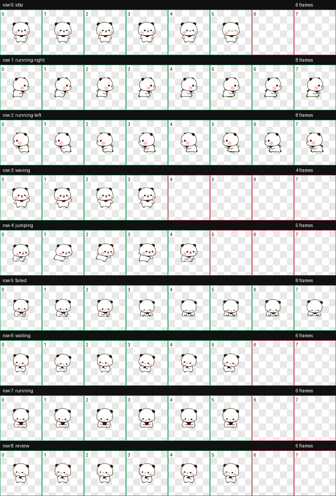

# YierPet 一二桌宠

一只住在你 macOS 桌面上的「一二」宝。它会散步、跳跃、挥手，会提醒你喝水和起身活动，深夜会催你睡觉，你摸鱼它会盯着你，CPU 飙高它会整只烧红，把它甩出去还会气鼓鼓地抗议。

纯 Swift + AppKit 原生实现，**零依赖、零权限、一条命令构建**。



## 功能特性

| 能力 | 说明 |
| --- | --- |
| 桌面悬浮 | 无边框透明窗口，置顶悬浮，无 Dock 图标，不打扰工作 |
| 四种形象 | 经典一二 / 一二表情包 / 布布表情包 / 一二布布合体，右键随时切换（见下节） |
| 9 种动画 | 待机 / 左右跑 / 挥手 / 跳跃 / 沮丧 / 等待 / 工作中 / 审阅，逐帧图集驱动 |
| 自主行为 | 每 7~15 秒随机散步、跳跃、挥手，碰到屏幕边缘自动掉头 |
| 气泡说话 | 头顶弹出圆角气泡，文案从语料池随机抽取，淡入淡出 |
| 健康提醒 | 久坐 / 喝水 / 深夜关怀 / 摸鱼检测，四项独立开关（见下表） |
| 系统哨兵 | CPU 红温 / 内存压力 / 电量 / 磁盘空间，异常时才冒气泡，五项独立开关（见下表） |
| 抛掷物理 | 拖住快速甩出，抛物线飞行、撞墙落地反弹；摔狠了会喊「请轻拿轻放一二大王！」 |
| 零权限 | 不申请辅助功能、不申请屏幕录制，全部使用公开系统 API |

## 四种形象

右键宠物 → 「形象」，四个版本随时切换，选择自动保存：

| 形象 | 内容 | 素材量 |
| --- | --- | --- |
| 经典一二 | 原版精灵图集小熊，9 种动作全部可用 | 1 张图集 |
| 一二表情包 | 白熊猫「一二」表情包动图，含红温全身着火名场面 | 26 组帧序列 |
| 布布表情包 | 棕熊「布布」表情包动图 | 15 组帧序列 |
| 一二布布合体 | 一二和布布同框的合体表情包 | 15 组帧序列 |

表情包模式下的行为：

- **待机**：从 idle / 犯懒 / 开心表情池随机循环播放，隔一会儿自动换一个
- **点击**：切换到开心 / 比心表情
- **抛掷重摔**：切换到生气表情 +「请轻拿轻放一二大王！」
- **提醒联动**：每个提醒会切换到对应情绪表情——CPU 红温时一二直接**全身着火**，久坐/摸鱼跳绳，喝水/低电量吃东西，深夜催睡，磁盘满了埋头干活
- 拖拽、抛掷物理、气泡、深夜睡意（播帧变慢）与经典版一致

每个表情是独立的透明帧序列（由 Live Photo 抠图裁剪而来），按需加载、播完释放，不会常驻大内存。素材归档在 `Assets/Packs/`，构建时拷入 app。

## 动作图鉴

| | | |
| :---: | :---: | :---: |
|  |  |  |
| 待机 | 向右跑 | 向左跑 |
|  |  |  |
| 挥手 | 跳跃 | 沮丧 |
|  |  |  |
| 等待 | 工作中 | 审阅 |

## 健康提醒

| 提醒 | 触发条件 | 一二的反应 |
| --- | --- | --- |
| 久坐提醒 | 连续活跃满 1 小时（离开电脑 5 分钟自动清零） | 走到屏幕底部中央蹦跶拦你 +「坐了一个小时啦，起来动动嘛！」 |
| 喝水提醒 | 每 30 分钟（人不在时不计时） | 举手示意 +「咕噜咕噜～该喝水啦！」 |
| 深夜关怀 | 23 点后进入睡意模式（待机动画变慢像打瞌睡），你还在干活则每 30 分钟关怀一次 | 担心地看你 +「熬夜会秃的！明天再做也来得及～」 |
| 摸鱼检测 | 视频类 App（B站 / 腾讯视频 / 爱奇艺 / IINA / VLC 等）连续前台 30 分钟 | 盯着你 +「都摸鱼半小时了哦……我可什么都没看见」 |

- 判断「你是否在电脑前」使用系统输入空闲时间（`CGEventSource`），前台 App 检测使用 `NSWorkspace`，**均无需任何权限**
- 提醒有优先级和 90 秒全局间隔，不会连环轰炸
- 每项提醒可在右键菜单独立开关，设置自动保存

## 系统哨兵

平时安静不打扰，只在指标异常时才提醒，全部使用原生系统 API（mach / IOKit / FileManager），不起子进程、不要权限：

| 哨兵 | 触发条件 | 一二的反应 |
| --- | --- | --- |
| CPU 红温 | 占用持续 90 秒 ≥ 85%（每 10 分钟最多提醒一次） | **整只渐渐烧红** + 惊慌乱跑 +「好烫好烫！CPU 都 97% 了，是谁在偷偷挖矿！」，降下来后自动退烧 |
| 内存压力 | 系统内存压力达到 critical（事件驱动，非轮询） | 等待动作 +「内存要被挤爆啦，关几个 App 让我喘口气～」 |
| 电量提醒 | 电量 ≤ 20% 且未插电（降到 10% 再催一次）；台式机无电池自动跳过 | 沮丧趴下 +「肚子饿了……电池只有 18% 了，插电插电！」 |
| 充满提醒 | 插电且电量 ≥ 98%（每次插电只提醒一次） | 开心挥手 +「吃饱啦～电池充满了，可以拔线啦！」 |
| 磁盘空间 | 根分区剩余 < 10%（每 6 小时最多提醒一次） | 审阅动作 +「磁盘只剩 9GB 空位啦，该大扫除了！」 |

红温效果说明：CPU 超过 60% 开始渐渐发红，越高越红（红色叠加层按精灵透明通道蒙版，只染身体不染背景），降回 60% 以下自动恢复。

## 安装运行

**环境要求**：macOS 13+，安装过 Xcode Command Line Tools（没有的话终端执行 `xcode-select --install`，几分钟装完）。

```bash
git clone https://github.com/xiaojieshi-bot/YierPet.git
cd YierPet
./build.sh
open build/YierPet.app
```

不需要完整 Xcode，不需要任何第三方依赖。

> 开机自启：把 `build/YierPet.app` 添加到 系统设置 → 通用 → 登录项。

## 使用说明

| 操作 | 效果 |
| --- | --- |
| 拖拽 | 抓着走，宠物朝拖动方向做跑步动画 |
| 快速甩出 | 抛掷！重力 + 反弹的物理飞行，摔狠了会生气 |
| 单击 | 挥手打招呼（表情包模式为开心/比心表情） |
| 右键 | 菜单：切换形象 / 切换 9 种动作（仅经典版）/ 暂停随机行为 / 提醒设置 / 退出 |
| 按住 Option + 右键 | 隐藏的「测试提醒」菜单，立即触发任意提醒看效果 |

## 自定义

**换台词**：所有气泡文案在 [`ReminderCenter.swift`](Sources/YierPet/ReminderCenter.swift) 的 `messages` 语料池中，每类提醒 4 条随机抽取，直接加减即可。

**调手感**：常用参数都在 [`PetController.swift`](Sources/YierPet/PetController.swift) 顶部：

| 参数 | 默认值 | 含义 |
| --- | --- | --- |
| `petSize` | 154 x 166 | 宠物尺寸 |
| `throwSpeedThreshold` | 550 pt/s | 甩多快算「抛掷」 |
| `gravity` | -3000 pt/s² | 重力 |
| `floorBounce` / `wallBounce` | 0.45 / 0.6 | 落地 / 撞墙反弹系数 |

**换形象**：替换 `Sources/YierPet/Resources/spritesheet.webp`。图集契约为 8 列 x 9 行（每格 192 x 208，总图 1536 x 1872），行序：idle、running-right、running-left、waving、jumping、failed、waiting、running、review，未使用格保持透明。各状态帧数与帧时长定义在 [`SpriteSheet.swift`](Sources/YierPet/SpriteSheet.swift)。

**改提醒节奏**：阈值都在 [`ReminderCenter.swift`](Sources/YierPet/ReminderCenter.swift) 顶部（久坐 1h、喝水 30min、摸鱼 30min、CPU 85%、磁盘 10% 等）。

## 项目结构

```
YierPet/
├── Sources/YierPet/
│   ├── main.swift            # 应用入口（accessory 模式，无 Dock 图标）
│   ├── SpriteSheet.swift     # 图集切帧 + 9 状态帧时长定义
│   ├── PetController.swift   # 动画状态机、拖拽、散步、抛掷物理、菜单
│   ├── SpeechBubble.swift    # 头顶气泡（子窗口，自动跟随）
│   ├── ActivityMonitor.swift # 输入空闲时间 + 前台 App 检测
│   ├── SystemMonitor.swift   # CPU / 内存压力 / 电池 / 磁盘采集（纯原生 API）
│   ├── ReminderCenter.swift  # 健康提醒 + 系统哨兵调度 + 文案语料池
│   ├── PackLibrary.swift     # 表情包资源加载（形象枚举 + meta 解析 + 情绪检索）
│   └── Resources/spritesheet.webp
├── Assets/Packs/             # 三套表情包帧序列（yier / bubu / duo + meta.json）
├── docs/                     # README 素材（动图预览、总览图）
├── Info.plist                # App 元数据模板
├── build.sh                  # 一键构建脚本
└── Package.swift             # SwiftPM 描述（可选，build.sh 不依赖它）
```

## 常见问题

**Q: 为什么 Dock 和程序坞里看不到它？**
设计如此（`LSUIElement`），桌宠不该占一个 Dock 位。退出请右键宠物 → 退出。

**Q: 需要给什么系统权限吗？**
不需要。久坐/摸鱼检测用的都是公开 API，不申请辅助功能、屏幕录制等任何权限。

**Q: 双击 app 提示"无法打开"？**
如果你是直接下载别人构建好的 `.app`（而非本地 `./build.sh` 构建），macOS Gatekeeper 会拦截未签名应用：右键 app → 打开 → 再点打开即可。本地构建的没有这个问题。

**Q: 摸鱼名单里没有我用的 App？**
在 [`ActivityMonitor.swift`](Sources/YierPet/ActivityMonitor.swift) 的 `slackBundleIDs` 里加上它的 bundle id（终端 `osascript -e 'id of app "App名字"'` 可查询）。

## 形象来源

宠物形象由黄小B创作，取一张静态图经 ChatGPT 生成 9 行动画帧总表，再用本仓库配套流水线切分、镜像、校验、合成为精灵图集（基于 [openai/skills](https://github.com/openai/skills) 的 hatch-pet 图集契约）。

## 许可证

[MIT](LICENSE)
